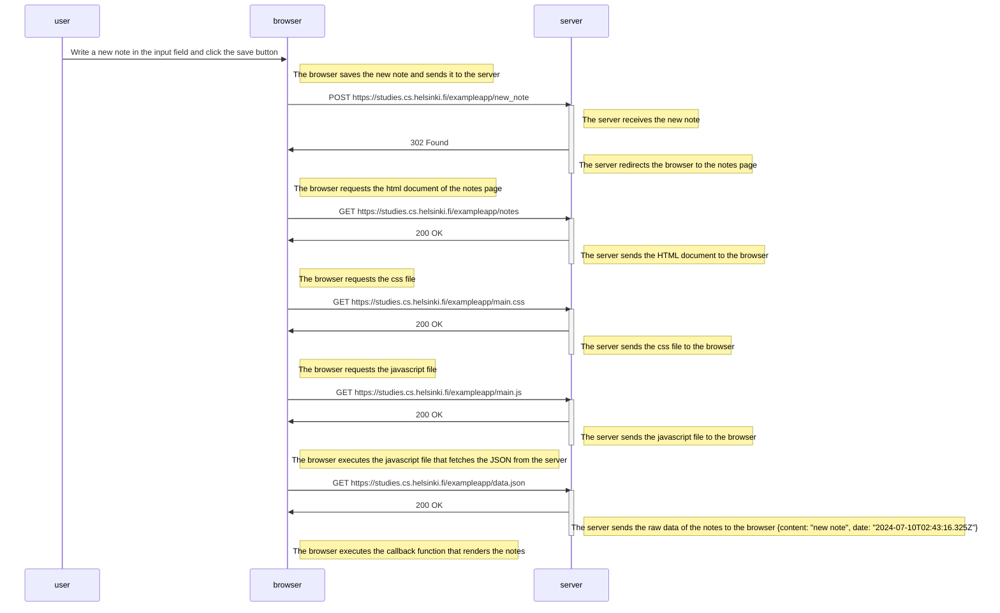

```mermaid
sequenceDiagram
participant user
participant browser
participant server

user->>browser: Write a new note in the input field and click the save button
Note right of browser: The browser saves the new note and sends it to the server

browser->>server: POST https://studies.cs.helsinki.fi/exampleapp/new_note
activate server
Note right of server: The server receives the new note
server->>browser: 302 Found
Note right of server: The server redirects the browser to the notes page
deactivate server

Note right of browser: The browser requests the html document of the notes page
browser->>server: GET https://studies.cs.helsinki.fi/exampleapp/notes
activate server
server->>browser: 200 OK
Note right of server: The server sends the HTML document to the browser
deactivate server

Note right of browser: The browser requests the css file
browser->>server: GET https://studies.cs.helsinki.fi/exampleapp/main.css
activate server
server->>browser: 200 OK
Note right of server: The server sends the css file to the browser
deactivate server

Note right of browser: The browser requests the javascript file
browser->>server: GET https://studies.cs.helsinki.fi/exampleapp/main.js
activate server
server->>browser: 200 OK
Note right of server: The server sends the javascript file to the browser
deactivate server

Note right of browser: The browser executes the javascript file that fetches the JSON from the server
browser->>server: GET https://studies.cs.helsinki.fi/exampleapp/data.json
activate server
server->>browser: 200 OK
Note right of server: The server sends the raw data of the notes to the browser {content: "new note", date: "2024-07-10T02:43:16.325Z"}
deactivate server

Note right of browser: The browser executes the callback function that renders the notes


```
