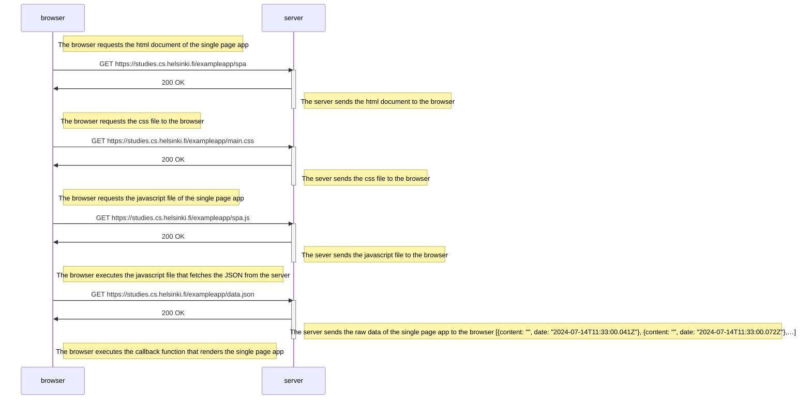

```mermaid
sequenceDiagram
 participant browser
 participant server

 Note right of browser: The browser requests the html document of the single page app
 browser->>server: GET https://studies.cs.helsinki.fi/exampleapp/spa
 activate server
 server->>browser: 200 OK
 Note right of server: The server sends the html document to the browser
 deactivate server

 Note right of browser: The browser requests the css file to the browser
 browser->>server: GET https://studies.cs.helsinki.fi/exampleapp/main.css
 activate server
 server->>browser: 200 OK
 Note right of server: The sever sends the css file to the browser
 deactivate server

 Note right of browser: The browser requests the javascript file of the single page app
 browser->>server: GET https://studies.cs.helsinki.fi/exampleapp/spa.js
 activate server
 server->>browser: 200 OK
 Note right of server: The sever sends the javascript file to the browser
 deactivate server

 Note right of browser: The browser executes the javascript file that fetches the JSON from the server
 browser->>server: GET https://studies.cs.helsinki.fi/exampleapp/data.json
 activate server
 server->>browser: 200 OK
 Note right of server: The server sends the raw data of the single page app to the browser [{content: "", date: "2024-07-14T11:33:00.041Z"}, {content: "", date: "2024-07-14T11:33:00.072Z"},…]
 deactivate server

 Note right of browser: The browser executes the callback function that renders the single page app
```
