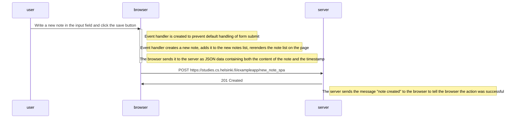

```mermaid
sequenceDiagram
participant user
participant browser
participant server

user->>browser: Write a new note in the input field and click the save button

activate browser
Note right of browser: Event handler is created to prevent default handling of form submit
Note right of browser: Event handler creates a new note, adds it to the new notes list, rerenders the note list on the page
Note right of browser: The browser sends it to the server as JSON data containing both the content of the note and the timestamp
deactivate browser

browser->>server: POST https://studies.cs.helsinki.fi/exampleapp/new_note_spa
activate server
server->>browser: 201 Created
Note right of server: The server sends the message "note created" to the browser to tell the browser the action was successful
```
